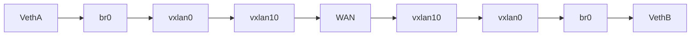

### Ports

#### Introduction
Il y a un certain nombre de ports à ouvrir pour que le cluster fonctionne.
#### Le ports à ouvrir
Voici les ports à ouvrir. Certaines doivent être accessibles par les noeuds et d'autres par les client externes. Ce tableau est extrait de la documentation officielle d'OKD et a été complétéepour notre cas d'usage.

#### 1/ Machine à machine

| Port/Potocol        	| Description                                                                                                          	|
|---------------------	|----------------------------------------------------------------------------------------------------------------------	|
| ICMP                	| Network reachability tests                                                                                           	|
| 9000-9999/TCP       	| Host level services, including the node exporter on ports 9100-9101 and the Cluster Version Operator on port  9099.  	|
| 10250-10259/TCP     	| The default ports that Kubernetes reserves.                                                                          	|
| 4789/UDP            	| VXLAN and Geneve                                                                                                     	|
| 6081/UDP            	| VXLAN and Geneve                                                                                                     	|
| 9000-9999/UDP       	| Host level services, including the node exporter on ports 9100-9101.                                                 	|
| 30000-32767/TCP-UDP 	| Kubernetes node port                                                                                                 	|

#### 2/ Machines aux machines de contrôle
| Port/Potocol  	| Description                          	|
|---------------	|--------------------------------------	|
| 2379-2380/TCP 	| etcd server, peer, and metrics ports 	|
| 6443/TCP      	| Kubernetes API                       	|

####  3/ Vers la machines Services
| Port/Potocol 	| Back-end machines (pool members) for load balancer                                                                                                                                                                                     	| Internal 	| External 	| Description                          	|
|--------------	|----------------------------------------------------------------------------------------------------------------------------------------------------------------------------------------------------------------------------------------	|----------	|----------	|--------------------------------------	|
| 6443/TCP     	| Bootstrap and control plane. You remove the bootstrap machine from the load balancer after the bootstrap machine initializes the cluster control plane. You must configure the /readyz endpoint for the API server health check probe. 	| X        	| X        	| Load Balancer: Kubernetes API server 	|
| 22623/TCP    	| Bootstrap and control plane. You remove the bootstrap machine from the load balancer after the bootstrap machine initializes the cluster control plane.                                                                                	| X        	|          	| Load Balancer: Machine config server 	|
| 443/TCP      	| The machines that run the Ingress router pods, compute, or worker, by default.                                                                                                                                                         	| X        	| X        	| Load Balancer: HTTPS                 	|
| 80/TCP       	| The machines that run the Ingress router pods, compute, or worker, by default.                                                                                                                                                         	| X        	| X        	| Load Balancer: HTTP                  	|
| 4789/UDP     	| /                                                                                                                                                                                                                                      	| X        	| X        	| VXLAN inter-site                     	|
| 67-68/UDP    	| /                                                                                                                                                                                                                                      	| X        	|          	| DHCP                                 	|
| 8080/TCP     	| /                                                                                                                                                                                                                                      	| X        	|          	| Web server to get ignition files     	|
| 53/UDP       	| /                                                                                                                                                                                                                                      	| X        	| X        	| DNS (see DNS part)                   	|


### DNS

#### Introduction
Il y a deux DNS dans le cluster, un interne et relatif aux conteneurs/services. Un externe et relatif aux nœuds (VM). Ici, nous parlons du deuxième étant donné que le premier est crée d'office et sans intervention.
#### Entrées DNS
Voici les entrées nécessaires dans le DNS. Certaines doivent être accessibles par les noeuds et d'autres par les client externes. Ce tableau est extrait de la documentation officielle d'OKD.

| Component      	| Record                                    	| Description                                                                                                                                                                                                                                                                                       	|
|----------------	|-------------------------------------------	|---------------------------------------------------------------------------------------------------------------------------------------------------------------------------------------------------------------------------------------------------------------------------------------------------	|
| Kubernetes API 	| api.<cluster_name>.<base_domain>.         	| Add a DNS A/AAAA or CNAME record, and a DNS PTR record, to identify the load balancer for the control plane machines. These records must be resolvable by both clients external to the cluster and from all the nodes within the cluster.                                                         	|
| Kubernetes API 	| api-int.<cluster_name>.<base_domain>.     	| Add a DNS A/AAAA or CNAME record, and a DNS PTR record, to identify the load balancer for the control plane machines. These records must be resolvable from all the nodes within the cluster.                                                                                                     	|
| Routes         	| *.apps.<cluster_name>.<base_domain>.      	| Add a wildcard DNS A/AAAA or CNAME record that refers to the load balancer that targets the machines that run the Ingress router pods, which are the worker nodes by default. These records must be resolvable by both clients external to the cluster and from all the nodes within the cluster. 	|
| Bootstrap      	| bootstrap.<cluster_name>.<base_domain>.   	| Add a DNS A/AAAA or CNAME record, and a DNS PTR record, to identify the bootstrap machine. These records must be resolvable by the nodes within the cluster.                                                                                                                                      	|
| Master hosts   	| <master><n>.<cluster_name>.<base_domain>. 	| Add DNS A/AAAA or CNAME records and DNS PTR records to identify each machine for the master nodes. These records must be resolvable by the nodes within the cluster.                                                                                                                              	|
| Worker hosts   	| <worker><n>.<cluster_name>.<base_domain>. 	| Add DNS A/AAAA or CNAME records and DNS PTR records to identify each machine for the worker nodes. These records must be resolvable by the nodes within the cluster.                                                                                                                              	|


### VxLAN
Nous avons décidé d'utiliser VxLAN pour interconnecter les différents sites. Nous présentons dans cette partie une introduction simple à VxLAN puis les choses mises en place pour avoir une interconnexion fonctionnelle entre les sites.

#### Introduction

VXLAN (Virtual Extensible LAN)  est un protocole permettant une communication de couche 2 via une liaison de niveau 4 grâce à une encapsulation. Les interfaces s'occupant d'encapsuler et décapsuler s'appellent les VTEPs (VXLAN tunnel endpoint). **Ce protocole n'offre pas de moyen de chiffrer les échanges**. Ce protocole nous permet de faire communiquer les nœuds du cluster via IP locale.


L'encapsulation VXLAN ajoutant 16 octets d'en tête dans le paquet IP, il faut prendre cela en compte lors de la configuration des interfaces réseaux. Voici un flux typique de "routage" de paquet entre 2 conteneurs d'OKD sur 2 sites différents pour le Network Provider choisi OpenShift SDN CNI:

On considère A et B 2 conteneurs OKD sur des sites distincts. Un flux de paquet typique entre A et B est:

 De plus, d'après la RFC7348 (https://tools.ietf.org/html/rfc7348) :
 ```
   VTEPs MUST NOT fragment VXLAN packets.  Intermediate routers may
   fragment encapsulated VXLAN packets due to the larger frame size.
   The destination VTEP MAY silently discard such VXLAN fragments.  To
   ensure end-to-end traffic delivery without fragmentation, it is
   RECOMMENDED that the MTUs (Maximum Transmission Units) across the
   physical network infrastructure be set to a value that accommodates
   the larger frame size due to the encapsulation.
   ```

De ce fait, on définit un MTU de 1400 octets pour les communications dans le cluster ( ....) et 1450 octets sur les interfaces des noeuds. De ce fait, lorsque le paquet sort du 2ème VTEP, le MTU de base de 1500 octets n'est pas dépassé.
La communication peut donc se faire sans problème de fragmentation de paquet et sans avoir à faire intervenir le WAN pour une augmentation du MTU.
