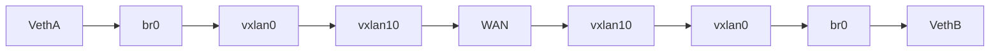

# Projet Cassiopée 
## Synthèse

Le projet est le suivant : Il est possible de remarquer un début d'obsolescence en ce qui concerne les plateformes de Travaux Pratiques "virtuels", encore plus aujourd'hui avec le contexte sanitaire. 

L'idée est alors de mettre en place une plateforme de la sorte qui va s'exécuter sur un Cloud Privé, donnant alors accès aux étudiants à des plateformes de développement à partir d'un simple navigateur web. 

Ainsi, le projet est le déploiement d'une plateforme Eclipse Che s'exécutant sur un cloud SaaS openshift, permettant alors aux étudiants et aux professeurs d'avoir accès à des environnements de développement, tout en s'inscrivant dans la charte des services déployés par l'école (Authentification Shibboleh, etc...).
 
Le projet s'inscrit alors dans le cadre de l'amélioration des plateformes de TP virtuels pour les différentes écoles du groupe IMT.

Dans ce document, nous décrivons la mise en place des différents outils nécessaires et donnons des éléments théoriques de base pour comprendre le fonctionnement.

L'environnement est le suivant :

Nous avons 1 serveur dont les caractéristiques sont :

- Processeur: 96 x AMD EPYC 7352 24-Core Processor (2 Sockets)
- RAM: 377,44 GB

L'intégration sera faite dans un réseau déjà existant (celui de la DISI).

## Table des matières

## Déploiement d'un cluster OKD sur proxmox (Pratique)

Dans un premier temps, il est nécessaire de déployer un cluster OKD qui nous servira de support pour déployer Eclipse Che.

#### Mention spéciale
Cette documentation est basée sur un guide<sup>(1)</sup> présent sur itnext.io écrit par Craig Robinson. Notre objectif est d'adapter cette documentation sur un environnement Proxmox pour en faciliter le déploiement.
### Architecture
Dans un premier temps, pour déployer le cluster il faut décider d'une [architecture](https://docs.okd.io/latest/architecture/architecture.html) pour ce dernier.
Pour ce cluster nous utiliserons l'architecture suivante :

Quant aux VM voici leur description :
|Machine| OS | vCPU | RAM (Go) | Stockage (Go) | Addresse IP
|--|--|--|--|--|--|
|services|CentOS 8|4|4|100|10.0.0.1 et ip publique|
|master 1|Fedora CoreOS 8|4|16|120|10.0.0.2|
|master 2|Fedora CoreOS 8|4|16|120|10.0.0.3|
|master 3|Fedora CoreOS 8|4|16|120|10.0.0.4|
|worker 1|Fedora CoreOS 8|4|16|120|10.0.0.5|
|worker 2|Fedora CoreOS 8 |4|16|120|10.0.0.6|
|bootstrap|Fedora CoreOS 8|4|16|120|10.0.0.7|
<!--end of table-->
Dans cette architecutre nous avons décidé de regrouper au sein de la VM `services` le DNS, Load Balances, Serveur Web, Routeur, DHCP et le pare-feu. Une variante<sup>(1)</sup> de cette architecture pourrait être d'isoler le pare-feu, routeur et DHCP sous une VM FreeBSD.
| NOTE: Pour ce déploiement, nous omettrons pour l'instant l'utilisation d'un pare-feu. |
| --- |

### Création du pont au sein de Proxmox
Pour que les VMs master 1 à bootstrap puissent communiquer entre elles ils faut les inscrire dans un sous-réseau, ainsi il faut créer un pont dans Proxmox comme suit :


Note: Vous pouvez aussi utiliser le script 'vmbr.py' qui créera un pont automatiquement.

Une fois ceci fait nous pouvons passer à la création des VMs.

### Création et configuration des VMs
Avant de créer les VMs il faut fournir à Proxmox les OS nécessaires à la création de ces dernières. Pour ce faire rendez-vous dans votre stockage et dans l'onglet "ISO Images" ajoutez les images de [CentOS](https://www.centos.org/download/) et de [Fedora CoreOS](https://getfedora.org/coreos/download?tab=cloud_launchable&stream=stable).
#### VM : Services
##### Création et configuration de la VM
Nous allons débuter le déploiement par la création de la machine virtuelle "services". Depuis votre nœud créez une VM en remplissant les informations suivantes :
 * OS : CentOS-8...
 * Hard Disk : Disk Size : 100
 * CPU : Cores : 4
 * Memory : 4096
 * Network : Ici choisissez l'un des ponts sur lequel votre VM communiquera
<!-- end of the list -->
Une fois la VM créée, rendez-vous dans l'onglet "Hardware" de cette dernière et ajoutez-y un nouveau périphérique réseau avec le second pont.
##### Installation et configuration de l'OS
On peut dès à présent lancer l'installation de l'OS.
L'installation étant indépendante du service de virtualisation, cette dernière se passe comme dans la documentation mentionnée précédemment :
>I prefer to use the “Standard Partition” storage configuration without mounting storage for /home. On the “Installation Destination” page, click on Custom under Storage Configuration, then Done.
>
>
>On the Manual Partitioning page, select Standard Partition, then click “Click Here to Create them automatically.”
>
>
>Select the “/home” partition and click the “-” to delete it.
>
>
>Remove the contents of the “Desired Capacity” field, so it is blank and click Done, then Accept the changes.
>
>
Bien qu'il est indiqué de choisir une VM avec interface graphique, nous avons fait le choix d'une VM sans interface graphique soit "server", par soucis d'optimisation et parce qu’une interface graphique ne présente pas de réel avantage pour l'utilisation dans ce cluster.
>For Software Selection, use Server with GUI and add the Guest Agents.
>
>
Pour cette étape, veillez à ce que votre interface réseau ayant accès à internet soit allumée et fonctionnelle. Pour l'autre interface, il n'est pas nécessaire de 
>
>
>Click “Begin Installation” to start the install.
>
>
>Set the Root password, and create an admin user.
>
>
>After the installation has completed, login, and update the OS.
>
>    ```
>    sudo dnf install -y epel-release
>    sudo dnf update -y  
>    sudo systemctl restart
>    ```

#### VM : bootstrap, masters et workers
Les VM restantes peuvent maintenant être créées, toutes les installations sont similaires on décrira ainsi une unique installation ici, celle de master1 :
 * OS : fedora-coreos...
 * Hard Disk : Disk Size : 120 GiB
 * CPU : Cores : 4
 * Memory : 16384 MiB
 * Network : Ici choisissez le pont créé plus tôt pour la communication interne des VM
<!--end of list-->

Ces VMs peuvent être déployés plus rapidement à l'aide du script "Cluster.py" présent dans le dépôt git. Il vous suffit d'avoir une clé API sur Proxmox.

#### VM : Services
##### Configuration du DHCP
Selon le serveur DHCP que vous utilisez, la configuration sera différente. Dans le cas de dhcpd, nous allons le configurer (dans /etc/dhcp/dhcpd.conf) de manière à associer à chaque adresse MAC des VM l'adresse IP correspondante décrite précédemment :
```
subnet 10.0.0.0 netmask 255.255.255.0 {
    range dynamic-bootp 10.0.0.15 10.0.0.30;
    option broadcast-address 10.0.0.255;
    option routers 10.0.0.1;

group{

host master1 {
                hardware ethernet <adresse MAC de la VM master1>;
                fixed-address 10.0.0.2;
       }
       ...
host bootstrap {
                hardware ethernet <adresse MAC de la VM bootstrap>; 
                fixed-address 10.0.0.7; 
        }
  }
}
```
A la fin de la configuration, redémarrez votre service, dans le cas de dhcpd :
```
service dhcpd restart
```
##### Configuration des différents services
Pour la configuration suivante on se basera une fois de plus sur la documentation citée plus haut, les fichiers utilisés seront donc trouvés par la même procèdure qu'énoncé dans ce dernier :
>Open a terminal on the okd4-services VM and clone the okd4_files repo that contains the DNS, HAProxy, and install-conf.yaml example files:
>```
>cd  
>git clone https://github.com/cragr/okd4_files.git
>cd okd4_files
>```

| NOTE: Pour ce déploiement, nous utiliserons un wildcard DNS (.nip.io ici) pour notre adresse IP publique |
| --- |
<!-- Ajouter un lien git pour nos fichiers de configuration par ici-->
##### Configuration du DNS
Une fois les fichiers récupérés, nous pouvons continuer la configuration à l'identique en prenant soin de modifier les fichiers pour qu'ils correspondent à notre infrastructure.

>Copy the named config files and zones:
>```
>sudo cp named.conf /etc/named.conf  
>sudo cp named.conf.local /etc/named/  
>sudo mkdir /etc/named/zones  
>sudo cp db* /etc/named/zones
>```
>Enable and start named:
>```
>sudo systemctl enable named  
>sudo systemctl start named  
>sudo systemctl status named
>```
>Restart the network services on the okd4-services VM:
>`sudo systemctl restart NetworkManager`
>
>Test DNS on the okd4-services.
>```
>dig okd.local  
>dig –x 192.168.1.210
>```
##### Installation du LoadBalancer
On passe maintenant à l'installation du LoadBalancer  :
>`sudo dnf install haproxy -y`
>
>Copy haproxy config from the git okd4_files directory :
>`sudo cp haproxy.cfg /etc/haproxy/haproxy.cfg`
>
>Start, enable, and verify HA Proxy service:
>```
>sudo setsebool -P haproxy_connect_any 1  
>sudo systemctl enable haproxy  
>sudo systemctl start haproxy  
>sudo systemctl status haproxy
>```
##### Installation du serveur web
Pour ce déploiement nous avons fait le choix d'utiliser nginx, les étapes d'installation sont donc les suivantes :
```
sudo dnf install -y nginx
```

On change ensuite le port du service pour qui l'écoute sur le 8080 :
```
sudo sed -i 's/Listen 80/Listen 8080/' /etc/nginx/nginx.conf
```

Finalement on active et démarre le service :
```
sudo systemctl enable nginx
sudo systemctl start nginx
```
On peut éventuellement tester le serveur web via :
```
curl localhost:8080
```
qui devrait nous donner le code source d'une page web en sortie.
### Installation et configuration des éléments du cluster OKD
#### VM : services
##### Téléchargement des images nécessaires
Depuis le [git du projet OKD](https://github.com/openshift/okd/releases) récupérez les fichiers de l'oc client et de l'openshift-install. Vous trouverez sur [ce lien](https://origin-release.apps.ci.l2s4.p1.openshiftapps.com/) une liste des fichiers mis à jour.
Poursuivez ensuite en remplançant par les liens trouvés au préalable :
>```
>cd  
>wget https://github.com/openshift/okd/releases/download/4.5.0-0.okd-2020-07-29-070316/openshift-client->linux-4.5.0-0.okd-2020-07-29-070316.tar.gz  
>wget https://github.com/openshift/okd/releases/download/4.5.0-0.okd-2020-07-29-070316/openshift-install->linux-4.5.0-0.okd-2020-07-29-070316.tar.gz
>```
>Extract the okd version of the oc client and openshift-install:
>```
>tar -zxvf openshift-client-linux-4.5.0-0.okd-2020-07-29-070316.tar.gz  
>tar -zxvf openshift-install-linux-4.5.0-0.okd-2020-07-29-070316.tar.gz
>```
>Move the kubectl, oc, and openshift-install to /usr/local/bin and show the version:
>```
>sudo mv kubectl oc openshift-install /usr/local/bin/  
>oc version  
>openshift-install version
>```
##### Configuration de l'openshift-installer
>In the install-config.yaml, you can either use a pull-secret from RedHat or the default of “{“auths”:{“fake”:{“auth”: “bar”}}}” as the pull-secret.
>
>Generate an SSH key if you do not already have one.
>```
>ssh-keygen
>```
>Create an install directory and copy the install-config.yaml file:
>```
>cd  
>mkdir install_dir  
>cp okd4_files/install-config.yaml ./install_dir
>```
>Edit the install-config.yaml in the install_dir, insert your pull secret and ssh key, and backup the install-config.yaml as it will be deleted in the next step:
>```
>vim ./install_dir/install-config.yaml  
>cp ./install_dir/install-config.yaml ./install_dir/install-config.yaml.bak
>```
>Generate the Kubernetes manifests for the cluster, ignore the warning:
>```
Dans notre cas nous avons aussi modifié légèrement le fichier install-config.yaml pour modifier les adresses IP données aux différents nœuds. En se référant à la [documentation officielle](https://docs.okd.io/latest/installing/installing_platform_agnostic/installing-platform-agnostic.html#installation-bare-metal-config-yaml_installing-platform-agnostic) on doit donc modifier le point (9) pour y mettre
```
serviceNetwork:  
-  10.0.0.0/16
```
>openshift-install create manifests --dir=install_dir/
>```
>Modify the cluster-scheduler-02-config.yaml manifest file to prevent Pods from being scheduled on the control plane machines:
>```
>sed -i 's/mastersSchedulable: true/mastersSchedulable: False/' install_dir/manifests/cluster-scheduler-02-config.yml
>```
>Create manifests/cluster-network-03-config.yml and modify it to fit out network configuration:
>```
```yaml
apiVersion: operator.openshift.io/v1
kind: Network
metadata:
  name: cluster
spec:
  defaultNetwork:
    openshiftSDNConfig:
      mtu: 1400
   ```
>```
>Now you can create the ignition-configs:
>```
>openshift-install create ignition-configs --dir=install_dir/
>```
>**Note:**  If you reuse the install_dir, make sure it is empty. Hidden files are created after generating the configs, and they should be removed before you use the same folder on a 2nd attempt.
##### Hébergement des ignition files sur le serveur web
>Create okd4 directory in /var/www/html:
>```
>sudo mkdir /var/www/html/okd4
>```
>Copy the install_dir contents to /var/www/html/okd4 and set permissions:
>```
>sudo cp -R install_dir/* /var/www/html/okd4/  
>sudo chown -R apache: /var/www/html/  
>sudo chmod -R 755 /var/www/html/
>```
>Test the webserver:
>```
>curl localhost:8080/okd4/metadata.json
>```
>Download the [Fedora CoreOS](https://getfedora.org/coreos/download/)  bare-metal bios image and sig files and shorten the file names:
>```
>cd /var/www/html/okd4/  
>sudo wget >https://builds.coreos.fedoraproject.org/prod/streams/stable/builds/32.20200715.3.0/x86_64/fedora-coreos-32.20200715.3.0-metal.x86_64.raw.xz  
>sudo wget >https://builds.coreos.fedoraproject.org/prod/streams/stable/builds/32.20200715.3.0/x86_64/fedora-coreos-32.20200715.3.0-metal.x86_64.raw.xz.sig  
>sudo mv fedora-coreos-32.20200715.3.0-metal.x86_64.raw.xz fcos.raw.xz  
>sudo mv fedora-coreos-32.20200715.3.0-metal.x86_64.raw.xz.sig fcos.raw.xz.sig  
>sudo chown -R apache: /var/www/html/  
>sudo chmod -R 755 /var/www/html/
>```


> :warning: **Sur toutes les vms**: taper nmtui puis configurer le MTU à 1450 (cf la partie sur le MTU)

#### Démarrage de la VM bootstrap:

>Power on the odk4-bootstrap VM. Press the TAB key to edit the kernel boot options and add the following:
>
>coreos.inst.install_dev=/dev/sda coreos.inst.image_url=http://192.168.1.210:8080/okd4/fcos.raw.xz >coreos.inst.ignition_url=http://192.168.1.210:8080/okd4/**bootstrap.ign**
>
>
>
>You should see that the fcos.raw.gz image and signature are downloading:
>
>
#### Démarrage des master
>Power on the control-plane nodes and press the TAB key to edit the kernel boot options and add the following, then press enter:
>
>coreos.inst.install_dev=/dev/sda coreos.inst.image_url=http://192.168.1.210:8080/okd4/fcos.raw.xz >coreos.inst.ignition_url=http://192.168.1.210:8080/okd4/**master.ign**
>
>
>
>You should see that the fcos.raw.gz image and signature are downloading:
>
>
>


#### Démararge des worker
>Power on the control-plane nodes and press the TAB key to edit the kernel boot options and add the following, then press enter:
>
>coreos.inst.install_dev=/dev/sda coreos.inst.image_url=http://192.168.1.210:8080/okd4/fcos.raw.xz >coreos.inst.ignition_url=http://192.168.1.210:8080/okd4/**worker.ign**
>
>
>
>You should see that the fcos.raw.gz image and signature are downloading:
>
>
>
>It is usual for the worker nodes to display the following until the bootstrap process complete:
>
>

## Installation d'Eclipse Che

Rendez-vous dans OperatorHub puis installez l'opérateur Eclipse Che. Cliquez ensuite sur celui-ci puis sur "Create CheCluster". Définissez les paramètres comme souhaités. N'oubliez pas de désactiver l'authentification OpenShift dans l'onglet Auth.

Attendez que les différents composants d'Eclipse Che se déploient. Puis visitez l'url donnée pour accéder au dashboard EclipseChe.

### Ajout d'une méthode d'authentification
Ici, nous allons utiliser un LDAP comme méthode d'authentification. Nous avons déployé celui-ci grâce à OpenLdap et nous ne décrirons pas le processus de déploiement ici.
#### 1/ Identifiants admin de keycloack
Premièrement, il faut récupérer les identifiants administrateurs de Keycloak. 
- Sur le dashboard OKD, allez dans "Operators ⇒ Installed Operators ⇒ Eclipse Che ⇒ Eclipse Che Cluster" sélectionnez le cluster Che que vous venez de déployer puis cliquez sur "Resourcers".
- Sélectionnez le "che-identity-secret" puis scrollez en bas. Vous pourrez alors récupérer les identifiants pour Keycloak.
#### 2/ Utiliser le LDAP comme méthode d'authentification
Rendez vous sur le lien Keycloak et connectez vous avec les identifiants précédemment récupérés.

Vous pouvez alors aller dans "User Federation" ⇒ "Add provider" et sélectionnez LDAP. Remplissez les informations de votre serveur LDAP. Vous pourrez alors utiliser le LDAP comme méthode d'authentification pour Eclipse Che.

### Ajouter des utlisiateurs sur le LDAP
> :warning: **Cette partie ne s'applique qu'au LDAP de notre projet**

Nous utilisons Ldap Manager pour avoir une interface graphique.
Rendez vous sur :  http://157.159.110.248:8081/lam puis connectez vous avec les identifiants admin du LDAP. Vous pourrez alors gérer le LDAP dans son intégralité et importer des utilisateurs au format CSV.

## Déploiement d'un cluster OKD sur proxmox (Eléments théoriques) 

### Ports

#### Introduction
Il y a un certain nombre de ports à ouvrir pour que le cluster fonctionne.
#### Les ports à ouvrir
Voici les ports à ouvrir. Certaines doivent être accessibles par les nœuds et d'autres par les client externes. Ce tableau est extrait de la documentation officielle d'OKD et a été complétée pour notre cas d'usage.

#### 1/ Machine à machine

| Port/Potocol        	| Description                                                                                                          	|
|---------------------	|----------------------------------------------------------------------------------------------------------------------	|
| ICMP                	| Network reachability tests                                                                                           	|
| 9000-9999/TCP       	| Host level services, including the node exporter on ports 9100-9101 and the Cluster Version Operator on port  9099.  	|
| 10250-10259/TCP     	| The default ports that Kubernetes reserves.                                                                          	|
| 4789/UDP            	| VXLAN and Geneve                                                                                                     	|
| 6081/UDP            	| VXLAN and Geneve                                                                                                     	|
| 9000-9999/UDP       	| Host level services, including the node exporter on ports 9100-9101.                                                 	|
| 30000-32767/TCP-UDP 	| Kubernetes node port                                                                                                 	|

#### 2/ Machines aux machines de contrôle
| Port/Potocol  	| Description                          	|
|---------------	|--------------------------------------	|
| 2379-2380/TCP 	| etcd server, peer, and metrics ports 	|
| 6443/TCP      	| Kubernetes API                       	|

####  3/ Vers la machines Services
| Port/Potocol 	| Back-end machines (pool members) for load balancer                                                                                                                                                                                     	| Internal 	| External 	| Description                          	|
|--------------	|----------------------------------------------------------------------------------------------------------------------------------------------------------------------------------------------------------------------------------------	|----------	|----------	|--------------------------------------	|
| 6443/TCP     	| Bootstrap and control plane. You remove the bootstrap machine from the load balancer after the bootstrap machine initializes the cluster control plane. You must configure the /readyz endpoint for the API server health check probe. 	| X        	| X        	| Load Balancer: Kubernetes API server 	|
| 22623/TCP    	| Bootstrap and control plane. You remove the bootstrap machine from the load balancer after the bootstrap machine initializes the cluster control plane.                                                                                	| X        	|          	| Load Balancer: Machine config server 	|
| 443/TCP      	| The machines that run the Ingress router pods, compute, or worker, by default.                                                                                                                                                         	| X        	| X        	| Load Balancer: HTTPS                 	|
| 80/TCP       	| The machines that run the Ingress router pods, compute, or worker, by default.                                                                                                                                                         	| X        	| X        	| Load Balancer: HTTP                  	|
| 4789/UDP     	| /                                                                                                                                                                                                                                      	| X        	| X        	| VXLAN inter-site                     	|
| 67-68/UDP    	| /                                                                                                                                                                                                                                      	| X        	|          	| DHCP                                 	|
| 8080/TCP     	| /                                                                                                                                                                                                                                      	| X        	|          	| Web server to get ignition files     	|
| 53/UDP       	| /                                                                                                                                                                                                                                      	| X        	| X        	| DNS (see DNS part)                   	|


### DNS

#### Introduction
Il y a deux DNS dans le cluster, un interne et relatif aux conteneurs/services. Un externe et relatif aux nœuds (VM). Ici, nous parlons du deuxième étant donné que le premier est crée d'office et sans intervention.
#### Entrées DNS
Voici les entrées nécessaires dans le DNS. Certaines doivent être accessibles par les noeuds et d'autres par les client externes. Ce tableau est extrait de la documentation officielle d'OKD.

| Component      	| Record                                    	| Description                                                                                                                                                                                                                                                                                       	|
|----------------	|-------------------------------------------	|---------------------------------------------------------------------------------------------------------------------------------------------------------------------------------------------------------------------------------------------------------------------------------------------------	|
| Kubernetes API 	| api.<cluster_name>.<base_domain>.         	| Add a DNS A/AAAA or CNAME record, and a DNS PTR record, to identify the load balancer for the control plane machines. These records must be resolvable by both clients external to the cluster and from all the nodes within the cluster.                                                         	|
| Kubernetes API 	| api-int.<cluster_name>.<base_domain>.     	| Add a DNS A/AAAA or CNAME record, and a DNS PTR record, to identify the load balancer for the control plane machines. These records must be resolvable from all the nodes within the cluster.                                                                                                     	|
| Routes         	| *.apps.<cluster_name>.<base_domain>.      	| Add a wildcard DNS A/AAAA or CNAME record that refers to the load balancer that targets the machines that run the Ingress router pods, which are the worker nodes by default. These records must be resolvable by both clients external to the cluster and from all the nodes within the cluster. 	|
| Bootstrap      	| bootstrap.<cluster_name>.<base_domain>.   	| Add a DNS A/AAAA or CNAME record, and a DNS PTR record, to identify the bootstrap machine. These records must be resolvable by the nodes within the cluster.                                                                                                                                      	|
| Master hosts   	| <master><n>.<cluster_name>.<base_domain>. 	| Add DNS A/AAAA or CNAME records and DNS PTR records to identify each machine for the master nodes. These records must be resolvable by the nodes within the cluster.                                                                                                                              	|
| Worker hosts   	| <worker><n>.<cluster_name>.<base_domain>. 	| Add DNS A/AAAA or CNAME records and DNS PTR records to identify each machine for the worker nodes. These records must be resolvable by the nodes within the cluster.                                                                                                                              	|


### VxLAN
Nous avons décidé d'utiliser VxLAN pour interconnecter les différents sites. Nous présentons dans cette partie une introduction simple à VxLAN puis les choses mises en place pour avoir une interconnexion fonctionnelle entre les sites.

#### Introduction

VXLAN (Virtual Extensible LAN)  est un protocole permettant une communication de couche 2 via une liaison de niveau 4 grâce à une encapsulation. Les interfaces s'occupant d'encapsuler et décapsuler s'appellent les VTEPs (VXLAN tunnel endpoint). **Ce protocole n'offre pas de moyen de chiffrer les échanges**. Ce protocole nous permet de faire communiquer les nœuds du cluster via IP locale.

L'encapsulation VXLAN ajoutant 16 octets d'en tête dans le paquet IP, il faut prendre cela en compte lors de la configuration des interfaces réseaux. Voici un flux typique de "routage" de paquet entre 2 conteneurs d'OKD sur 2 sites différents pour le SDN OpenShift CNI:

On considère A et B 2 conteneurs OKD sur des sites distincts. Un flux de paquets typique entre A et B est:

 De plus, d'après la RFC7348 (https://tools.ietf.org/html/rfc7348) :
 ```
   VTEPs MUST NOT fragment VXLAN packets.  Intermediate routers may
   fragment encapsulated VXLAN packets due to the larger frame size.
   The destination VTEP MAY silently discard such VXLAN fragments.  To
   ensure end-to-end traffic delivery without fragmentation, it is
   RECOMMENDED that the MTUs (Maximum Transmission Units) across the
   physical network infrastructure be set to a value that accommodates
   the larger frame size due to the encapsulation.
   ```

De ce fait, on définit un MTU de 1400 octets pour les communications dans le cluster et 1450 octets sur les interfaces des noeuds. De ce fait, lorsque le paquet sort du 2ème VTEP, le MTU de base de 1500 octets n'est pas dépassé.
La communication peut donc se faire sans problème de fragmentation de paquet et sans avoir à faire des modifications sur le WAN pour une augmentation du MTU.

## Troubleshooting (Eclipse CHE)
### Où regarder ?
#### 1) Pour chaque workspace
Pour les informations relatives à chacun des workspace, les informations se trouvent dans `View > Output`.
#### 2) Pour eclipe che en général
Concernant chaque operateur, pour trouver leurs logs il faut naviguer à travers les pods dans `Workloads > Pods`. On y trouve alors plusieurs pods pour différentes tâches de chaque opérateur, en cliquant sur l'un d'entre eux et en se rendant dans l'onglet `Logs` on obtient alors les logs du pod concerné.

### Quels sont les problèmes recontrés ?
##### Terminal qui ne s'affiche pas sous Firefox
<ins>Bug</ins> : Il arrive que le terminal d'un workspace ne s'affiche pas sous firefox.
<ins>Commentaire</ins> : Le bug a été reconnu en tant qu'issue sur le github officiel du projet eclipse che [#13736](https://github.com/eclipse/che/issues/13736).
<ins>Correctif</ins> : Le problème viendrait d'une ancienne version de Firefox, une mise à jour est donc nécessaire. Autrement, désactiver "csp" semble aussi régler le problème.

##### Problème d'autorisation d'accès aux informations du pod
<ins>Bug</ins> : Lors de l'exécution de certaines tâches, le workspace tente d'accèder aux informations du pod et n'y parvient pas
<ins>Commentaire</ins> : Le bug a été reconnu en tant qu'issue sur le github officiel du projet eclipse che [#18812](https://github.com/eclipse/che/issues/18812).
<ins>Correctif</ins> : Les permissions sont bien établies (accessibles depuis [ce lien](https://che-eclipse-che.apps.paasdf.157.159.110.248.nip.io/swagger/#!/permissions)). Le problème n'a pas de correctif pour le moment, mais devrait être corrigé pour la prochaine mise à jour d'eclipse che [#19331](https://github.com/eclipse/che/issues/19331).

##### Dashboard vide
<ins>Bug</ins> : Après une manipulation (à déterminer) le dashboard n'affiche plus rien excépté `ChunkLoadError: Loading chunk 0 failed`.
<ins>Commentaire</ins> : Aucun commentaire sur le bug pour le moment.
<ins>Correctif</ins> : Rafraîchir la page semble résoudre le problème.

 ## Authentification et utilisation de Keycloak / Shibboleth :
 
 ### Mise en place de Shibboleth :
 En utilisant l'authentification fédérée de Shibboleth permet d'ouvir la connexion à une instance Pod à toute personne possédant un compte dans une fédération Shibboleth, justement ce qui nous intéresse ici pour l'authentificatin grâce à la Fédération Education - Recherche Renater.
 Ainsi, il faut d'abord commencer par l'installation d'un Service Provider Shibboleth, puisque chaque application doit posséder son propre Service Provider.
 
 #### Mise en place du Service Provider (SP) : 
 On utilisera ici le LDAP définit plus tôt : rendez-vous sur : http://157.159.110.248:8081/lam pour l'interface graphique de Ldap Manager)
 ### Installation de Shibboleth : 
 Shibboleth IdP est un servlet JAVA qui va utiliser n'importe quel Java ervlet 2.4 Container (On va utiliser Apache-Tomcat ici).
 Commençons par l'installation de Java : 
 ```
 apt install java-1.8.0-openjdk
 apt install java-1.8.0
 ```
 Par la suite, installons les paquets nécessaires au serveur tomcat et donnons les accès à un nouvel utilisateur tomcat pour qu'il puisse toucher à tous les dossiers nécessaires :
  ```
 apt install tomcat9
 /usr/sbin/useradd tomcat
 chown tomcat /etc/init.d/tomcat9
 chmod 755 /etc/init.d/tomcat9
 chmod +x tomcat/bin/*.sh
 chown -R tomcat /etc/tomcat9
 ```
 
 Par la suite, il va falloir configurer un fichier XML qui va permettre de déployer une brique Shibboleth IdP sans avoir à faire un lien symbolique ou un appel continu. Ainsi, nous allons créer un nouveau dossier et un nouveau fichier :
 ```
 mkdir -p /etc/tomcat9/Catalina/localhost/
 nano /etc/tomcat9/Catalina/localhost/idp.xml
 ```
 ``` 
             /etc/tomcat9/Catalina/localhost/idp.xml            
 <Context docBase="/opt/shibboleth-idp/war/idp.war" privileged="true" antiResourceLocking="false"                               antiJARLocking="false"                                                                                                  unpackWAR="false" />                                                                                     
 ```
 
 Installons maintenant Shibboleth et donnons le droit à tomcat d'accéder à ces fichiers-ci :
 
 ``` 
 mkdir /opt/src
 cd /opt/src/
 wget https://shibboleth.net/downloads/identity-provider/latest4/shibboleth-identity-provider-4.1.2.zip
 wget https://shibboleth.net/downloads/identity-provider/latest4/shibboleth-identity-provider-4.1.2.zip.asc
 unzip shibboleth-identity-provider-4.1.2.zip
 cd shibboleth-identity-provider-4.1.2 
 ./install.sh
 chown -R tomcat /opt/shibboleth-idp/
 ```
 Grâce au lien fait avec idp.xml, normalement, si le serveur tomcat est restart, nous pourrons voir que l'idp est bien inclus dans les applications. Pour ceci, nous allons simplement installer le paquet de gestion de tomcat, pour pouvoir avoir accès à l'interface manager de tomcat.
 ```
 apt install tomcat9-admin
 ```
 On peut alors y accéder, mais nous préférons garder cette plateforme manager accessible uniquement au "manager", c'est à dire en local à partir de la machine. Ainsi, pour y avoir accès, nous allons changer notre commande de ssh pour "ramener" le localhost sur notre machine.
 ```
 ssh -L 8080:localhost:8080 157.159.110.39
```
 On peut maintenant avoir accès à la page manager de tomcat et on voit bien la présence de idp dans l'application list : http://localhost:8080/manager/html (Les identifiants sont trouvables au niveau de /etc/tomcat9/tomcat-users.xml)
 
 
### Sources
 
(1) - [Guide: Installing an OKD 4.5 Cluster](https://itnext.io/guide-installing-an-okd-4-5-cluster-508a2631cbee)
